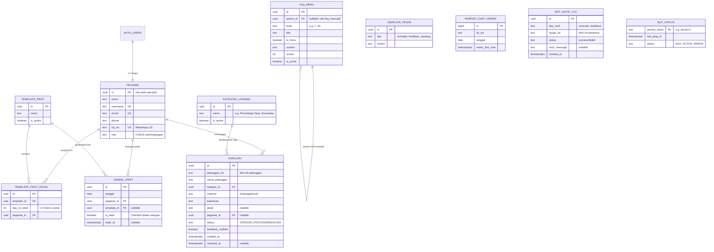

# Perancangan Ulang Database SIPASTI (Revisi 1)

Berdasarkan diskusi dan *feedback* dari kebutuhan sistem, berikut adalah hasil revisi rancangan ERD dan struktur tabel. 

Semua tabel yang sebelumnya dirancang telah disesuaikan agar lebih tepat guna, tidak *over-engineering*, dan sesuai dengan format operasional yang berjalan.

---

## Ringkasan Perubahan Berdasarkan Feedback

1. **Pegawai & Akun WA:** Ditambahkan kolom `lid_wa` sebagai identifier WhatsApp pada tabel `pegawai`.
2. **Desain FAQ (Nested):** Tabel `faq_kategori` dan `faq_item` digabung menjadi satu tabel `faq_menu` dengan skema *self-referencing* (`parent_id`) untuk mendukung struktur bertingkat sesuai file `faq_data.json`.
3. **Absen & Log Notifikasi:** Atribut `notified` pada jadwal dihapus dan diganti dengan tabel `bot_notif_log` untuk mencatat riwayat notifikasi. Ditambahkan atribut `is_hadir` dan `hadir_at` pada tabel `jadwal_piket` untuk checklist absen pegawai.
4. **Tabel Pelanggan Dihapus:** Sesuai arahan, tabel `pelanggan` tidak diimplementasikan. Tabel `eskalasi` akan langsung menggunakan `pelanggan_lid` dan `nama_pelanggan`.
5. **Penyesuaian Tabel Eskalasi:** 
   - Status diubah menjadi: `OPEN`, `ON_PROCESS`, dan `RESOLVED`.
   - Ditambah kolom `kategori_id` yang merujuk pada tabel baru `kategori_layanan`.
   - Ditambah kolom `channel` (whatsapp, email, dll).
   - Dihapus kolom `waktu_respons`.
   - Ditambah kolom `feedback_notified` (boolean) untuk tracking survei kepuasan.
6. **Simplifikasi Chat Log:** Tabel `chat_log` diganti dengan `riwayat_chat_harian` yang hanya menyimpan `lid_wa`, `tanggal`, dan `waktu_first_chat`. Ini cukup untuk menghitung total pelanggan harian dan tren waktu sibuk.
7. **Template Pesan:** Dibuat tabel `template_pesan` untuk menyimpan redaksi *greeting*, *reminder*, dan *feedback survei*.
8. **Monitoring Bot:** Dibuat tabel `bot_status` untuk mencatat aktivitas *ping* setiap 15 menit dari *service* WA-bot.

---

## Proposed ERD (Entity Relationship Diagram)

---

## Detail Struktur Tabel Baru / Direvisi

### 1. `faq_menu` (Mengakomodasi Nested/2 Jenjang)
Tabel *self-referencing* ini sangat fleksibel dan persis memetakan struktur file `faq_data.json` Anda.

| Kolom | Tipe | Keterangan |
|-------|------|------------|
| `id` | UUID | PK |
| `parent_id` | UUID | FK ke `faq_menu(id)`, null jika root/menu utama |
| `kode` | TEXT | Identifier visual (misal: "1", "3", "3A") |
| `title` | TEXT | Judul menu (tampil di bot) |
| `is_menu` | BOOLEAN | Jika true, artinya punya sub-menu di bawahnya |
| `content` | TEXT | Teks respons bot (jawaban/deskripsi menu) |
| `urutan` | INTEGER | Urutan tampil |

### 2. `jadwal_piket` & `bot_notif_log` (Checklist Absen & Notifikasi)
- `jadwal_piket` kini memiliki **`is_hadir`** (BOOLEAN, default `false`) dan **`hadir_at`** (TIMESTAMPTZ). Saat petugas datang dan mengeklik "Hadir" di dashboard, data ini diperbarui.
- Atribut `notified` dihapus, diganti tabel terpisah **`bot_notif_log`** untuk mencatat histori pengiriman notifikasi (kapan, tipe notif, ke siapa, berhasil/gagal).

### 3. `eskalasi` & `kategori_layanan`
Tabel `eskalasi` disesuaikan agar independen:

| Kolom | Tipe | Keterangan |
|-------|------|------------|
| `pelanggan_lid` | TEXT | Nomor LID WhatsApp pelanggan |
| `nama_pelanggan` | TEXT | Hasil inputan form bot |
| `kategori_id` | UUID | FK ke tabel `kategori_layanan` |
| `channel` | TEXT | `whatsapp`, `email`, `walk-in` (default `whatsapp`) |
| `status` | TEXT | `OPEN`, `ON_PROCESS`, `RESOLVED` |
| `feedback_notified` | BOOLEAN | Default `false`. Petugas klik tombol manual untuk kirim survei. |
| `resolved_at` | TIMESTAMPTZ | Diisi otomatis saat status jadi `RESOLVED` |

### 4. `riwayat_chat_harian` (Simplifikasi Chat Log)
Menjawab kebutuhan tren dan waktu sibuk secara efisien:

| Kolom | Tipe | Keterangan |
|-------|------|------------|
| `lid_wa` | TEXT | Identifier pelanggan |
| `tanggal` | DATE | Tanggal interaksi (YYYY-MM-DD) |
| `waktu_first_chat` | TIMESTAMPTZ | Kapan chat pertama hari itu dikirim |

*Constraint Unique* pada `(lid_wa, tanggal)` memastikan bot hanya melakukan *INSERT* satu kali per hari per pelanggan. Jam sibuk bisa dihitung dengan men-group berdasarkan jam dari `waktu_first_chat`.

### 5. `bot_status` (Monitoring WA Bot)
Digunakan oleh Web App untuk memonitor apakah service bot masih hidup.

| Kolom | Tipe | Keterangan |
|-------|------|------------|
| `service_name` | TEXT | PK, misal: `'wa-bot-utama'` |
| `last_ping_at` | TIMESTAMPTZ | Di-update oleh bot via API Web App setiap 15 menit |
| `status` | TEXT | `'IDLE'`, `'ACTIVE'`, `'ERROR'` |

**Logika di Dashboard Web App:** Jika `last_ping_at` > 20 menit yang lalu, maka tampilkan indikator 🔴 **Offline/Down**. Jika baru, tampilkan 🟢 **Online/IDLE/ACTIVE**.

---

## Verifikasi Plan

Saya siap memulai *development* dan mengonversi skema ini ke file *migrations* (dengan menimpa/memperbaiki 001-007 yang sudah ada, atau membuat file migration baru tergantung strategi deployment Anda). 

1. Apakah kita akan **drop tabel yang ada dan recreate seluruhnya** (karena masih fase development), atau perlu file migrasi inkremental? (Sebaiknya reset saja agar bersih).
2. Jika sudah disetujui, saya akan mulai menulis file migration SQL-nya.
